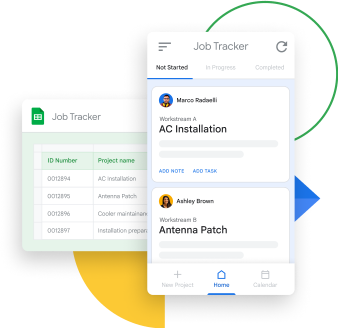
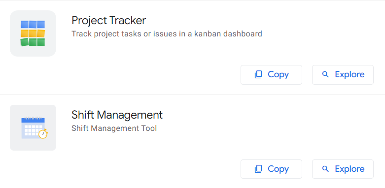

# AppSheet

## Что такое AppSheet?

https://about.appsheet.com

### Для чего?

1. AppSheet - Универсальный инструмент для создание программы (CRM, Системы учета и т.д.) под нужды малого и среднего бизнеса.
   Вот список шаблонов https://www.appsheet.com/Templates можете выбрать любую и переделать под себя (Переходите по ссылке и нажмите Explore).
   

2. На AppSheet можно создать программу и без навыков программирование, там код не пишется, формы и логика системы создается как конструктор.
   Конечно программисты имеют преимущество.

### Преимущество системы

#### 1. Качество и стабильность
AppSheet - это продукт от IT гиганта Google, значить качество и стабильность уже гарантировано.
#### 2. Бесплатная версия
AppSheet - предлагает базовую бесплатную версию программы. Вы платите только один раз программисту за реализацию логики системы.  
#### 3. Не зависите от исполнителя (программиста)
Программа написанной AppSheet передается клиенту с исходником и с базой, это значить любой другой программист может продолжить работу, 
тем самым вы никак не зависите от исполнителя.
#### 4. Открытость и прозрачность данных
В качестве базы данных для программы можно использовать уже знакомой всем инструмент Google Sheets (Гугл таблицы), это значить данные у вас всегда под рукой.
#### 5. Сохранность данных
Даже если потеряете ноутбук или мобильный телефон программа и ваши данные никуда не пропадает, так как это облачная система и привязана к вашему Google аккаунту. Главное знать свой логин и пароль от аккаунта.
#### 6. Открытая система
В отличие готовых систем, программа созданная с помощью AppSheet не монолитная, можно всегда изменить под ваши нужды. 
Вносить небольшие изменения в программу можете без помощи программиста, даже со временем можете освоить систему и самостоятельно добавить функционал под ваши нужды.
#### 7. Удобства и мобильность
Можно работать через мобильное приложение.
#### 8. Исключение ошибок и человеческого фактора
В отличие ввода данных напрямую в таблицу, тут можно исключить ошибки и человеческий фактор.
Конечно если программист предусмотрел логику проверки данных.
#### 9. Синхронизация контактов клиентов
Можно настроить так, чтобы когда вы добавляете в программу контакты клиентов или контрагентов эти контакты добавляется и на ваши контакты в телефоне.

### Недостатки системы
1. Система начинает работать медленно с увеличением массива данных, например 20-30 тысячи записей в одной таблице. Проблема решается архивированием данных уже закрытых месяцев оставив только суммарные результаты
Качество системы зависит от исполнителя (программиста) так - как компания Google дает только инструмент а логику программы делает уже программисты.
2. Ручной ввод данных.
3. Базовая бесплатная версия это ценовая политика от Google, никто не гарантирует что это всегда так будет. Но подписка там не очень дорого, начинается от $5. Подробнее по ссылке: https://about.appsheet.com/pricing

### 7 Причин когда AppSheet для вас:
1. 

### 7 Причин когда AppSheet не для вас:
1. У вас уже есть платная CRM или учетная система и вы довольны продуктом и это окупается.
2. Бизнес генерирует много данных, например несколько тысячи записей каждый день, тогда конечно лучше использовать профессиональные платные инструменты.
3. Если у вас крупная компания, где за данные и отчеты отвечает профильные специалисты и где используется профессиональные бизнес инструменты.  
4. На вашем бизнесе не требуется собственная система учета, например таксист - где уже есть готовые решения как Uber, InDriver и т.д.
5. Вас вполне устраивает учет данных в таблицах. Это нормально!
6. Вас в принципе не интересует учет данных и статистика.
7. Вас не убедили вышеупомянутые преимущества, бывает.
